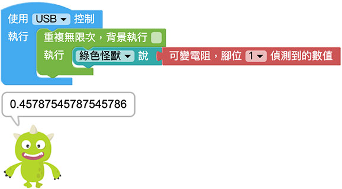

# 可變電阻

可變電阻是種可以經由滑動，而改變滑動端與兩個固定端之間電阻值的電子零件，可變電阻通常具有三個端子，其中有兩個是固定接點以及一個滑動接點，不少生活中的電器都能看見可變電阻的身影，例如隨身聽的音量大小旋鈕、可以調整亮度的電燈開關...等，此外通常在轉到最小的一側，還會附帶關閉電源的功能。

> 如果要使用可變電阻，需搭配 Web:Bit 擴充板，購買方式請參考：[Web:Bit 擴充板](https://store.webduino.io/products/webbit-extension-board?utm_source=webbit&utm_medium=article#_blank)

## 可變電阻積木清單

可變電阻積可以透過指定的腳位，讀取旋鈕轉動的數值 ( 0～1 的小數點數值 )

## 可變電阻接線圖

將擴充套件包裡的可變電阻的 S 連接 Web:Bit 開發板 1 號腳，VCC 連接 3.3V，GND 連接 GND。

## 小怪獸顯示可變電阻數值

將「小怪獸說話」的積木放入「重複無限次」的積木裡，再將「可變電阻，腳位 X 偵測到的數值」連接小怪獸積木，程式執行後，旋轉可變電組旋鈕，就會看見小怪獸講出對應的數值，往某一側旋轉會發現數字變大 ( 最大 1 )，反之數字會變小 ( 最小 0 )。

使用「四捨五入」搭配「尺度轉換」的積木，能將偵測到 0～1 的小數點數值，轉換為 0～1000 的整數。( 亦可轉換成任意區間的數值 )，程式執行後，就會看見剛剛的小數點數值，已經轉換成整數了。

## 可變電阻調整蜂鳴器播放速度

將上面的程式做點變化，使用「變數」積木紀錄四捨五入到小數點一位的可變電組數值，並將這個變數設定為回圈的「等待時間」，接著在每次迴圈執行時讓蜂鳴器播放聲音，程式執行後，轉動旋鈕，就會聽見蜂鳴器播放的速度有所不同。

> 範例：[可變電阻調整蜂鳴器播放速度](https://webbit.webduino.io/blockly/?demo=default#a355lAvP07l3m)

